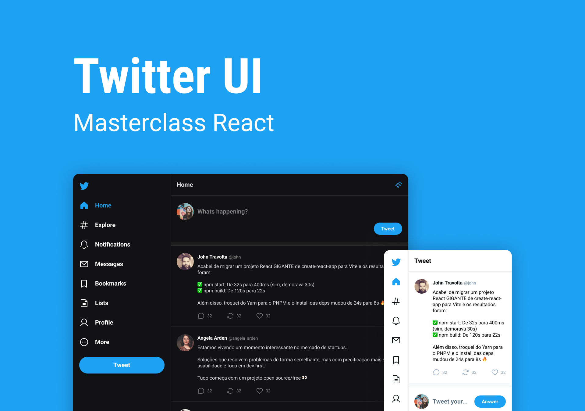

# Twitter - Masterclass React 

<div>
  
  
  
</div>



> Project carried out during Rocketseat's React Masterclass

<br />

## 🧪 Technologies

This project was developed using the following technologies:

- [ReactJS](https://reactjs.org/)
- [TypeScript](https://www.typescriptlang.org/)
- [ViteJS](https://vitejs.dev/)

<br></br>

## 🚀 Getting started

Clone the project and access the folder.

```bash
$ git clone https://github.com/leticiar-io/ui-twitter.git
$ cd ui-twitter
```

Follow the steps below:

```bash
# Install the web dependencies
$ npm install
# Start the web project
$ npm run dev
```


[⬆ Back to top](#ui-twitter)<br>